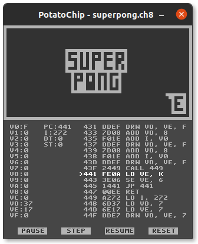

# PotatoChip

A small SuperChip interpreter written in Python using pygame.

## Usage

```
python potatochip [OPTIONS] ROM

Options:
-d  --dbg               Debugger
    --speed SPEED       Emulation speed
    --scale SCALE       Window size
```

## PSP Port


The port is very slow to run and requires [PSP Stackless Python](https://code.google.com/archive/p/pspstacklesspython/).

* Extract `StacklessPSP-2.5.2_R1.zip` and copy `cpu.py` and `utils.py` from `potatochip/` to `python.zip`.
* Specify the ROM path in `load_rom()` call in `script.py`.

Only `cross` is mapped to quit the emulation.

## Debugger



`SPACE`: Pause/Resume<br/>
`N`: Step through next instruction<br/>
`ESC`: Reset